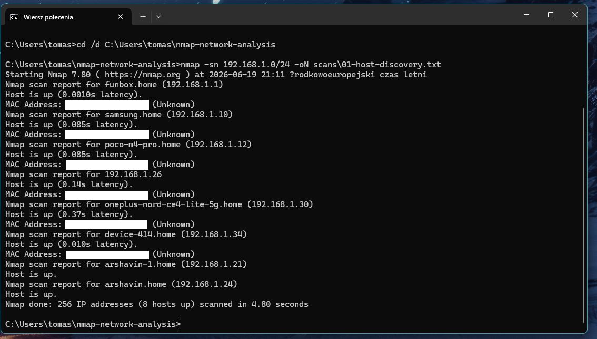
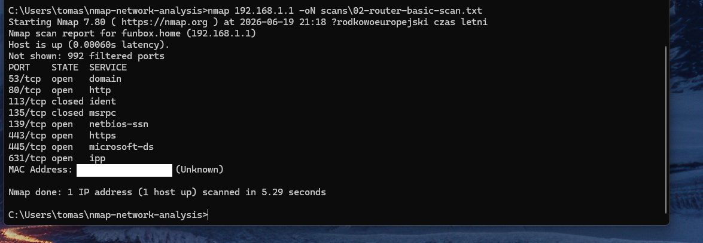
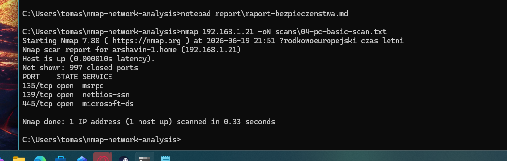
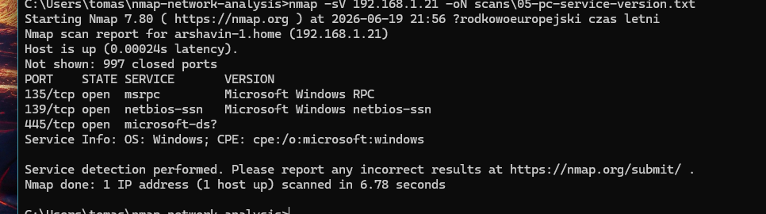

# Analiza sieci lokalnej z wykorzystaniem Nmap

## Opis projektu

Projekt przedstawia podstawową analizę bezpieczeństwa sieci lokalnej z wykorzystaniem narzędzia **Nmap**. Celem było wykrycie aktywnych hostów w sieci, identyfikacja otwartych portów, rozpoznanie usług oraz przygotowanie krótkiego raportu bezpieczeństwa.

Projekt został wykonany jako ćwiczenie praktyczne pod kątem pracy w obszarze cyberbezpieczeństwa, szczególnie na stanowiskach typu **Junior SOC Analyst**, **Security Analyst** lub **IT Support/Security**.

## Cel projektu

Główne cele projektu:

* wykrycie aktywnych urządzeń w sieci lokalnej,
* wykonanie podstawowego skanowania hosta i routera,
* identyfikacja otwartych portów i usług,
* rozpoznanie wersji usług,
* zapis wyników skanowania do plików,
* przygotowanie analizy bezpieczeństwa,
* przedstawienie rekomendacji ograniczających ryzyko.

## Użyte narzędzia

* Nmap
* Windows Terminal / CMD
* GitHub
* Markdown
* Sieć lokalna LAN/Wi-Fi

## Zakres testów

Analiza obejmowała wyłącznie własną sieć lokalną oraz urządzenia, do których miałem uprawnienia. Projekt nie obejmuje skanowania zewnętrznych adresów IP ani systemów osób trzecich.

## Wykonane skany

W projekcie wykonano kilka typów skanów.

### Wykrywanie aktywnych hostów

```bash
nmap -sn 192.168.1.0/24 -oN scans/01-host-discovery.txt
```

### Podstawowe skanowanie routera

```bash
nmap 192.168.1.1 -oN scans/02-router-basic-scan.txt
```

### Podstawowe skanowanie hosta Windows

```bash
nmap 192.168.1.21 -oN scans/04-pc-basic-scan.txt
```

### Rozpoznawanie wersji usług

```bash
nmap -sV 192.168.1.21 -oN scans/05-pc-service-version.txt
```

## Wyjaśnienie przykładowego polecenia

Polecenie:

```bash
nmap 192.168.1.1 -oN scans/02-router-basic-scan.txt
```

oznacza:

* `nmap` — uruchomienie narzędzia Nmap,
* `192.168.1.1` — adres IP badanego urządzenia, najczęściej routera,
* `-oN` — zapis wyniku w normalnym formacie tekstowym,
* `scans/02-router-basic-scan.txt` — lokalizacja pliku z wynikiem skanowania.

## Zrzuty ekranu

### Wykrywanie hostów w sieci lokalnej



### Podstawowe skanowanie routera



### Podstawowe skanowanie hosta Windows



### Rozpoznawanie wersji usług na hoście Windows



## Wyniki analizy

Podczas skanowania wykryto aktywne urządzenia w sieci lokalnej oraz sprawdzono usługi dostępne na wybranych hostach. Szczególną uwagę zwrócono na otwarte porty, ponieważ mogą one wskazywać na dostępne usługi administracyjne, webowe lub sieciowe.

Na routerze wykryto między innymi usługi takie jak DNS, HTTP, HTTPS oraz inne usługi sieciowe. Na hoście Windows wykryto porty typowe dla usług systemowych, między innymi RPC, NetBIOS oraz SMB.

## Wnioski bezpieczeństwa

Na podstawie wykonanych skanów można wskazać kilka podstawowych zasad bezpieczeństwa:

* nieużywane usługi powinny być wyłączone,
* panel administracyjny routera nie powinien być dostępny z internetu,
* hasło administratora routera powinno być silne i unikalne,
* firmware urządzenia powinien być regularnie aktualizowany,
* sieć Wi-Fi powinna korzystać z WPA2 lub WPA3,
* usługi SMB powinny być dostępne wyłącznie w zaufanej sieci lokalnej,
* warto okresowo sprawdzać, jakie urządzenia są podłączone do sieci.

## Raport

Pełny raport z analizy znajduje się tutaj:

[Zobacz raport](raport.md)

## Czego nauczyłem się w projekcie

Podczas realizacji projektu przećwiczyłem:

* podstawowe użycie Nmap,
* wykrywanie hostów w sieci lokalnej,
* skanowanie portów,
* rozpoznawanie usług,
* zapisywanie wyników skanowania,
* interpretację wyników pod kątem bezpieczeństwa,
* tworzenie krótkiego raportu technicznego,
* dokumentowanie projektu na GitHubie.

## Zastosowanie w SOC

Projekt pokazuje podstawy pracy analityka bezpieczeństwa. Umiejętność rozpoznawania hostów, usług i potencjalnie ryzykownych portów jest przydatna przy analizie alertów, triage incydentów oraz ocenie powierzchni ataku w sieci.

## Autor

Tomasz Stanula
GitHub: https://github.com/vincibit
